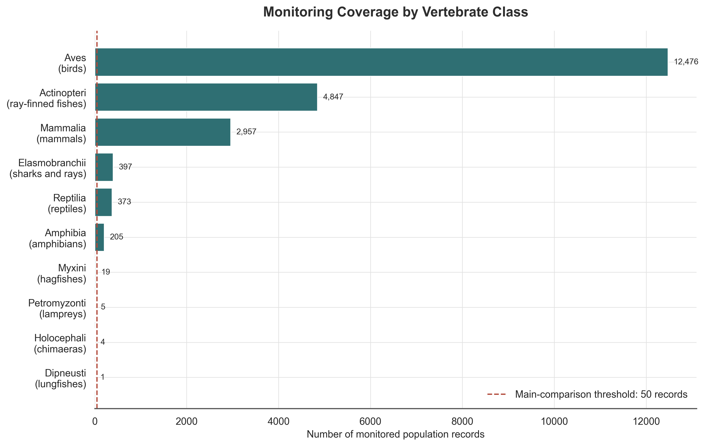
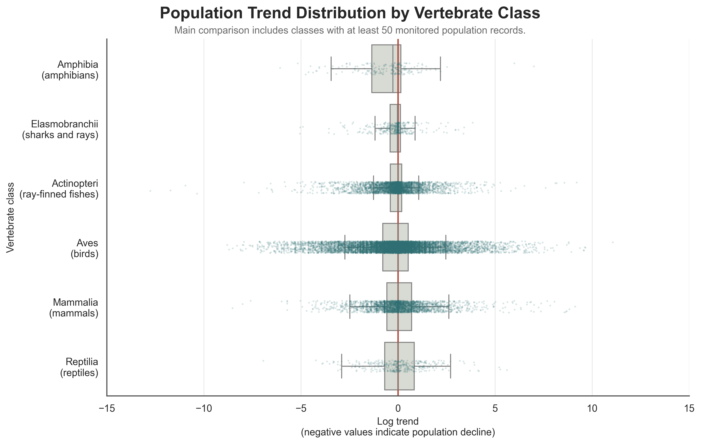
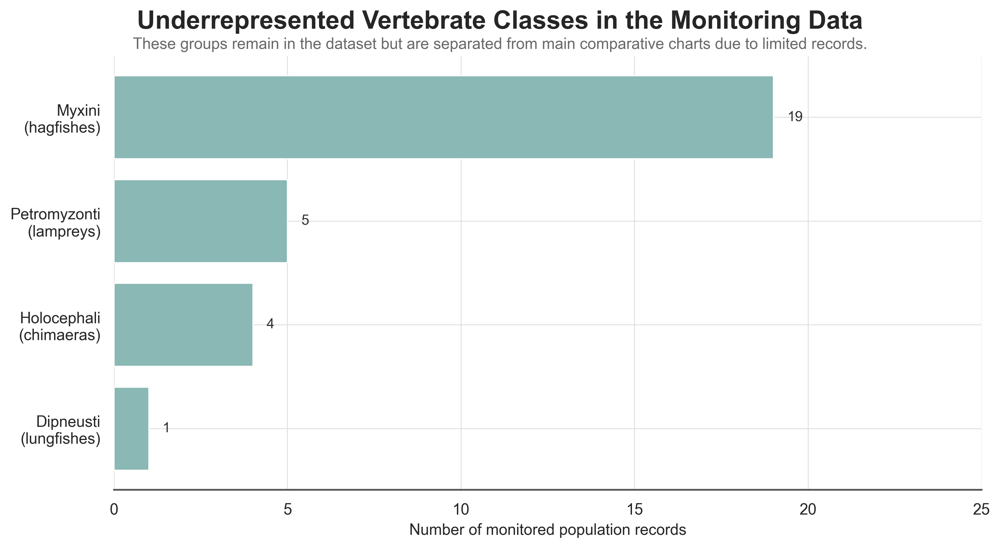
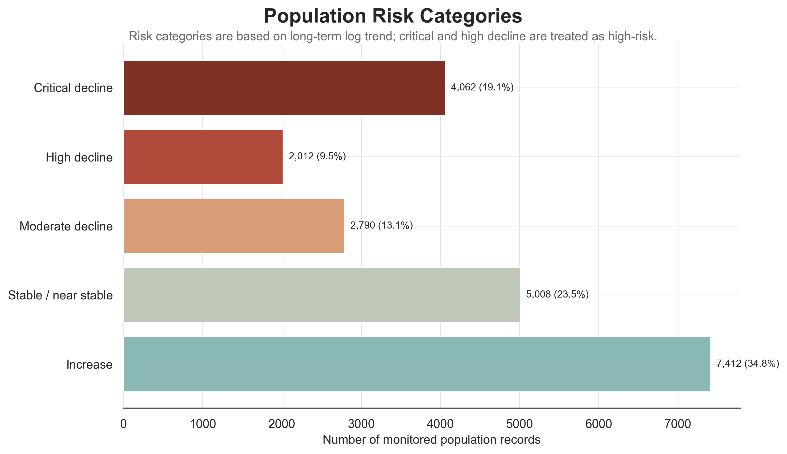
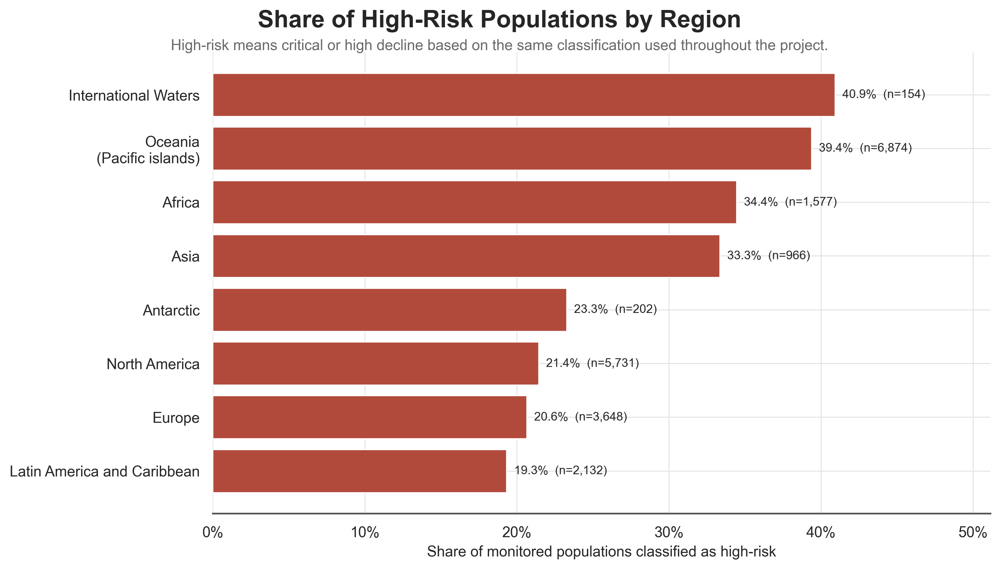
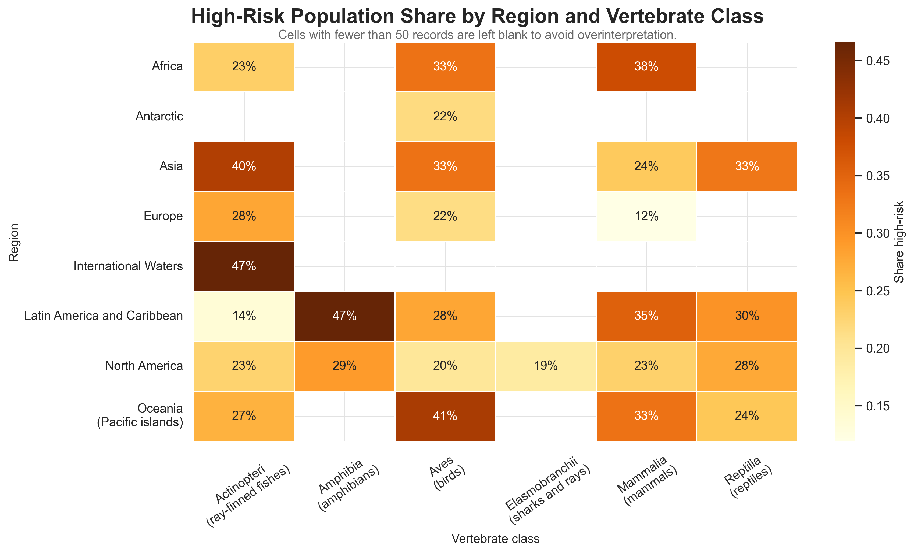
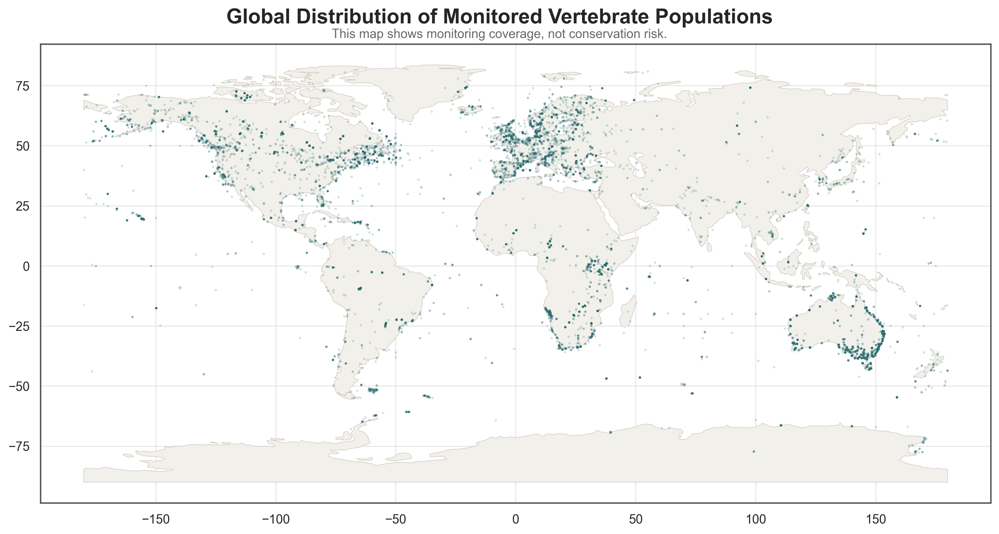
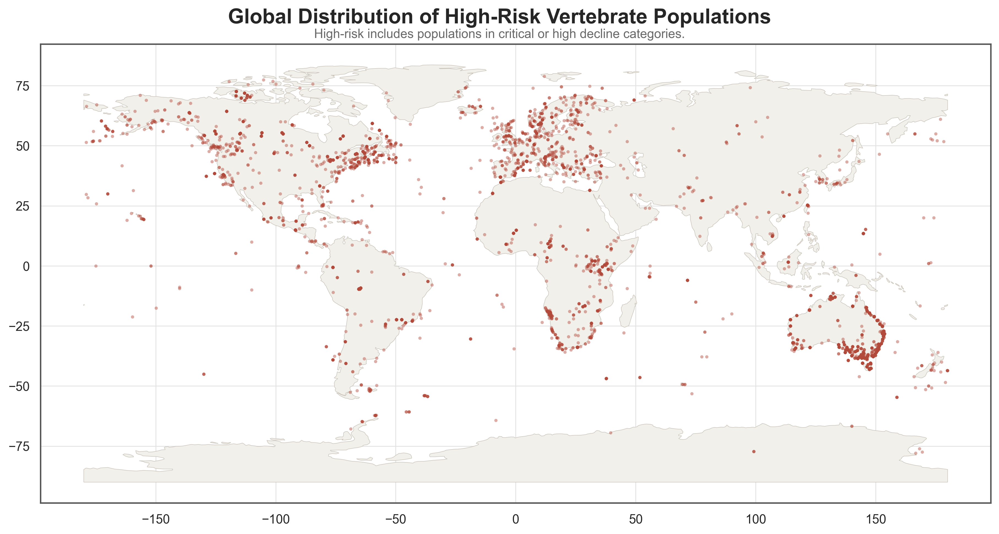
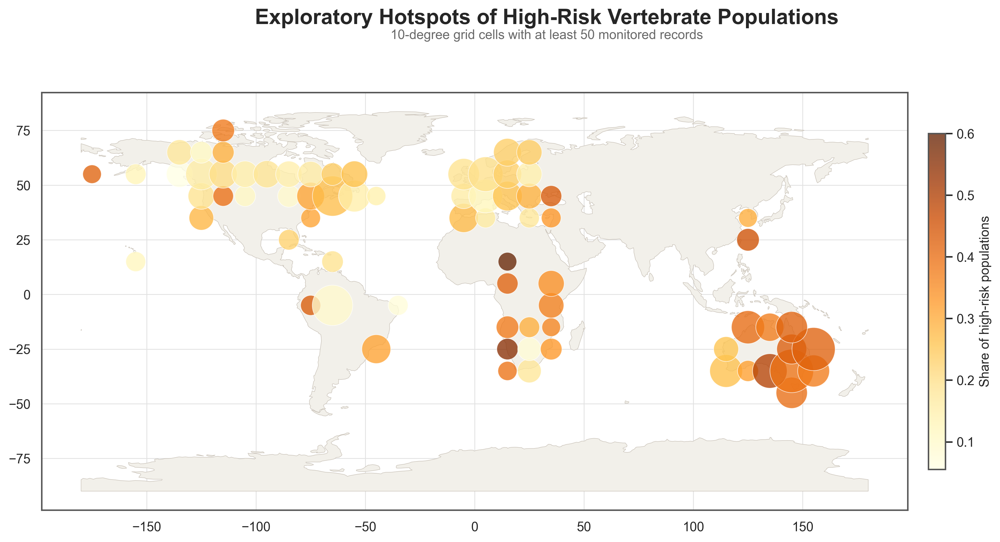

# Global Vertebrate Population Declines

### Identifying high-risk population trends and geographic hotspots using the Living Planet Database

**Data analysis project | Python | Biodiversity analytics | Stakeholder communication**

---

## Project overview

Biodiversity loss is often communicated through global averages. These averages are useful, but they can hide important differences between animal groups, ecosystems, and regions.

This project uses the **Living Planet Database 2024** to analyse long-term population trends in vertebrates worldwide. The goal is to turn scientific monitoring data into clear, decision-oriented insights that could support conservation planning, communication, and prioritisation.

The main question is:

> **Which vertebrate groups and world regions show the strongest signs of population decline, and where are high-risk populations geographically concentrated?**

The project follows a full analytical workflow: from data exploration and trend calculation to risk classification, spatial analysis, and stakeholder-readable visual communication.

---

## Why this project is relevant

Conservation organisations often need to communicate complex scientific evidence to mixed audiences: researchers, policy teams, donors, project managers, and the public.

This project therefore focuses not only on analysis, but also on **translation of scientific data into accessible visual insights**.

The analysis demonstrates how population-monitoring data can help identify:

- which monitored populations are declining most strongly;
- which vertebrate groups are most affected;
- which regions contain higher shares of high-risk populations;
- where high-risk population records are geographically clustered;
- where monitoring data is limited and should be interpreted carefully.

---

## Dataset

This project uses the publicly available **Living Planet Database (LPD) 2024** provided by the Zoological Society of London (ZSL), one of the world's largest collections of vertebrate population monitoring records.

### Original dataset

* Source: Living Planet Database 2024 (Zoological Society of London)
* Geographic scope: global
* Taxonomic scope: vertebrate populations
* Temporal coverage: 1950–2020
* Observation unit: individual monitored population
* Total monitored populations: 35,996
* Total species: 5,177

The dataset includes:

* population abundance time series
* species information
* taxonomic classification
* geographic coordinates
* geographic regions
* ecosystem type (terrestrial, freshwater, marine)
* monitoring metadata

The database covers major vertebrate groups, including mammals, birds, reptiles, amphibians, bony fishes, sharks and rays, and several smaller vertebrate classes.

### Processed dataset used in this analysis

To analyse long-term population change, the dataset was transformed from wide format (annual abundance values stored in separate year columns) into a population time-series format.

For trend analyses, only populations monitored for at least 10 years were retained in order to reduce the influence of short and potentially unstable monitoring records.

After processing and filtering:

* Number of analysed populations: 21,284
* Number of species represented: 5,177
* Number of global regions: 8
* Number of vertebrate classes analysed: 10
* Time period analysed: 1950–2020

### Data limitations

Monitoring effort is not evenly distributed across taxa and geographic regions. Some groups, such as birds and bony fishes, are represented by substantially more population records than amphibians, reptiles, or other vertebrate classes.

Similarly, regions differ considerably in monitoring intensity, reflecting differences in research capacity, funding availability, conservation priorities, and long-term ecological monitoring programs.

These differences do not invalidate the dataset, but they should be considered when interpreting global biodiversity patterns and comparing trends across taxonomic groups and regions.





---

## Research questions

1. What are the overall population trends in the Living Planet Database?
2. Which vertebrate classes show the strongest population declines?
3. Which regions contain the highest share of high-risk populations?
4. Which combinations of vertebrate class and region show the clearest risk patterns?
5. Where are high-risk populations geographically concentrated?
6. Which parts of the dataset require careful interpretation due to limited monitoring coverage?

---

## Analytical workflow

### 1. Initial exploration

The first notebook explores the structure of the Living Planet Database, including taxonomic coverage, geographic coverage, ecosystem types, and monitoring duration.

Notebook:

[00_lpd_initial_exploration.ipynb](notebooks/00_lpd_initial_exploration.ipynb)

### 2. Population trend calculation

The second notebook calculates long-term population trends. Population change is measured using log trend between the first and last available observation for each monitored population.

Notebook:

[01_population_trend_calculation.ipynb](notebooks/01_population_trend_calculation.ipynb)


### 3. Risk classification

Each monitored population is classified into one consistent risk category:

| Risk category | Interpretation |
|---|---|
| Critical decline | severe long-term decrease |
| High decline | strong decrease |
| Moderate decline | noticeable decrease |
| Stable / near stable | little overall change |
| Increase | positive trend |

Populations classified as **Critical decline** or **High decline** are treated as **high-risk populations** throughout the project.

Notebook:

[02_risk_analysis.ipynb](notebooks/02_risk_analysis.ipynb)

### 4. Spatial analysis

The spatial notebook maps monitored populations, high-risk populations, regional patterns, and exploratory hotspot grids.

Notebook:

[03_spatial_analysis.ipynb](notebooks/03_spatial_analysis.ipynb)

### 5. Stakeholder-readable figures

The final notebook creates presentation-ready figures with readable labels for animal groups and regions. These figures are designed for README, portfolio, and stakeholder communication.

Notebook:

[04_stakeholder_readable_figures.ipynb](notebooks/04_stakeholder_readable_figures.ipynb)

---

## Key findings

### 1. Population declines are not evenly distributed across vertebrate groups

Well-represented vertebrate classes show different population-trend distributions. Some groups have stronger negative trends than others, indicating that biodiversity pressure is not uniform across the tree of life.





---

### 2. Underrepresented groups should not be ignored, but they require careful interpretation

Some vertebrate classes have very few monitored population records in the dataset. These groups are retained in the analysis but separated from main comparative charts because small sample sizes can create misleading visual patterns.

This distinction matters because a small number of population records can indicate either limited monitoring coverage or genuinely rare lineages. In both cases, the correct interpretation is caution rather than deletion.





---

### 3. A substantial share of monitored populations is declining

Risk classification shows that many monitored populations fall into moderate, high, or critical decline categories. This suggests that biodiversity loss is visible not only at the level of individual species, but across many monitored populations.





---

### 4. Biodiversity risk is geographically uneven

The share of high-risk populations differs across broad biogeographic regions. This means that conservation priorities cannot be based only on global averages.





---

### 5. Risk depends on both geography and animal group

The strongest patterns appear when region and vertebrate class are examined together. Some region-class combinations show a higher share of high-risk populations than others.

This type of analysis can support targeted conservation communication: not only “where is biodiversity declining?”, but also “which animal groups are most affected in each region?”





---

### 6. Monitoring coverage is geographically concentrated

The map of all monitored populations shows where the Living Planet Database has stronger data coverage. This is important because spatial patterns of risk should be interpreted together with spatial patterns of monitoring effort.





---

### 7. High-risk populations are geographically clustered

High-risk population records are not evenly distributed across the globe. They appear in spatial clusters, suggesting that some regions may deserve closer conservation attention or more detailed follow-up analysis.





---

### 8. Exploratory hotspot screening can support prioritisation

The hotspot grid aggregates population records into broad 10-degree cells. Bubble size reflects monitoring volume, while colour reflects the share of high-risk populations.

This is not a formal conservation-priority model, but it is a useful exploratory screening tool for communicating where risk and monitoring data overlap.





---

## Main conclusion

## Main conclusion

The analysis shows that vertebrate population decline is unevenly distributed across both geography and animal groups.

At the regional level, the highest share of high-risk populations appears in International Waters and Oceania / Pacific islands. However, these patterns require different interpretation: International Waters show the highest high-risk share, but with a smaller number of monitored populations, while Oceania combines a very high-risk share with a large monitoring base.

At the animal-group level, amphibians show the strongest negative median population trend among the main interpretable vertebrate groups. Sharks and rays also show a negative median trend, while birds, mammals, reptiles, and ray-finned fishes have median trends closer to zero. This does not mean these groups are not at risk; rather, risk becomes clearer when animal group and region are analysed together.

The most pronounced high-risk combinations include amphibians in Asia, birds in Oceania / Pacific islands, ray-finned fishes in Asia, and mammals in Africa. These results suggest that biodiversity decline should not be communicated only through global averages. A more useful conservation message is: risk is concentrated in specific region–group combinations, and these patterns must be interpreted together with monitoring coverage.

A key methodological lesson is that underrepresented groups should not be removed from the analysis, but they should be separated from broad comparative claims. This project therefore combines scientific analysis of long-term population trends with stakeholder-oriented communication that makes biodiversity risk understandable without hiding uncertainty.


---

## Tools used

- Python
- Pandas
- NumPy
- Matplotlib
- Seaborn
- GeoPandas
- Jupyter Notebook

---

## Repository structure

```text
├── data
│   ├── raw
│   └── processed
│
├── notebooks
│   ├── 00_lpd_initial_exploration.ipynb
│   ├── 01_population_trend_calculation.ipynb
│   ├── 02_risk_analysis.ipynb
│   ├── 03_spatial_analysis.ipynb
│   └── 04_stakeholder_readable_figures.ipynb
│
├── outputs
│   ├── figures
│   └── stakeholder_figures
│
├── src
│
├── requirements.txt
└── README.md
```

---

## How to reproduce the workflow

Run the notebooks in this order:

```text
00_lpd_initial_exploration.ipynb
01_population_trend_calculation.ipynb
02_risk_analysis.ipynb
03_spatial_analysis.ipynb
04_stakeholder_readable_figures.ipynb
```

The stakeholder-ready figures will be saved to:

```text
outputs/stakeholder_figures/
```

---

## Author

**Mariya Aravina**

Research background: molecular biology, reproductive genetics, animal-focused scientific work  
Current focus: data analytics, project management, scientific communication, translating complex data into actionable insights
